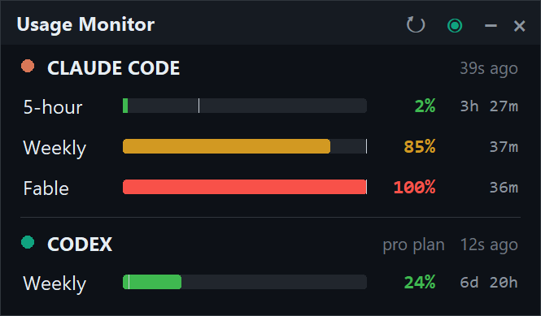

# Usage Monitor

[](https://github.com/Salaz7/claude-codex-usage/actions/workflows/ci.yml)
[](https://github.com/Salaz7/claude-codex-usage/releases/latest)
[](LICENSE)


A tiny always-on-top Windows widget that shows your Claude Code and Codex usage
limits at a glance. Pure monitoring: it never switches accounts and never writes
any credential file, so it cannot interfere with Claude Code or Codex.



## Download

Grab the latest **`UsageMonitor.exe`** from the
[Releases page](https://github.com/Salaz7/claude-codex-usage/releases/latest). It
is a single self-contained file that bundles its own Python runtime, so there is
nothing to install: put it anywhere and double-click it.

Because the exe is unsigned, the first launch may show a SmartScreen notice
("Windows protected your PC"). Click **More info -> Run anyway**. Prefer to build
it yourself from the single-file source? See [Requirements](#requirements) and
[Rebuild after editing](#rebuild-after-editing).

## What it shows

- **Claude Code** (active account): the 5-hour window, the weekly window, and the
  per-model **Fable** limit, each with a percent and a live reset countdown.
- **Codex**: whichever windows Codex reports (5-hour and/or weekly), with percent
  and reset countdown, plus your plan type.

Each bar is colored by how full it is (green under 70%, amber 70-90%, red over
90%). The faint vertical tick on each bar is the **pace marker**: where usage
would be if you spent it evenly across the window. Fill to the right of the tick
means you are burning faster than the window resets.

## Requirements

**To run the app** (the prebuilt `UsageMonitor.exe`):

- **Windows 10 or 11** (64-bit). Windows only for now.
- **Claude Code installed and logged in at least once**, so its credential file
  exists at `%USERPROFILE%\.claude\.credentials.json`. The app reads your usage
  with that existing login. It never stores, changes, or transmits it anywhere
  except the one usage request to Anthropic that Claude Code itself makes.
- **Optional: Codex** used at least once, so it has written usage into
  `%USERPROFILE%\.codex\sessions\...`. If you don't use Codex, that section just
  shows "No Codex sessions found".
- Nothing else to install. The exe bundles its own Python runtime.

Because the exe is unsigned, the first launch may show a SmartScreen notice
("Windows protected your PC"). Click **More info -> Run anyway**.

**To build it yourself, run from source, or run the tests**, you also need:

- **[uv](https://docs.astral.sh/uv/)** installed. It provides Python 3.12 and
  Tkinter automatically. PyInstaller is fetched on demand by `build.ps1`, so
  there is nothing else to set up.

> Note: the built `dist\UsageMonitor.exe` is not committed to git (binaries
> bloat the history). After cloning, build it with `.\build.ps1`, or attach it
> to a GitHub Release for others to download. To commit it anyway, remove
> `dist/` from `.gitignore`.

## Run it

Build it once with `.\build.ps1` (see Requirements), then double-click
**`dist\UsageMonitor.exe`**. That is the whole app, a single self-contained
file. Put it anywhere (Desktop, a Tools folder, wherever).

- Drag the title bar to move it. Its position is remembered.
- Title bar buttons: **↻** refresh now, **◉ / ○** toggle always-on-top,
  **−** hide to the tray, **×** quit.
- Right-click anywhere on the widget for the same actions.

### System tray

The app also puts a **live number** icon in the notification area: your worst
(highest) Claude limit on top and worst Codex limit below, each colored
green/amber/red by severity. Hover for the full breakdown as a tooltip, even
while the widget is hidden. (At 150-200% display scaling the tray icon is 32px
and the numbers are crisp; at 100% it is 16px, where the colors read clearly and
the tooltip gives the exact figures.)

- **Left-click** the tray icon to show or hide the widget.
- **Right-click** it for a menu: Show/Hide, Refresh now, Always on top, Quit.

So you can tuck the widget away with **−** and bring it back from the tray
whenever you want. Closing with **×** or the tray's Quit exits completely and
removes the tray icon.

To launch it automatically at login, press `Win+R`, type `shell:startup`, and
drop a shortcut to `UsageMonitor.exe` into that folder.

## How it gets the data (reads local files, no Codex CLI needed)

- **Claude Code**: reads the OAuth access token Claude Code stores on Windows in
  `~/.claude/.credentials.json`, then calls the same endpoint Claude Code uses,
  `GET https://api.anthropic.com/api/oauth/usage`. The token never leaves your
  machine except in that one request to Anthropic, and it is never written
  anywhere.
- **Codex**: reads the most recent `rate_limits` snapshot Codex writes into its
  session logs at `~/.codex/sessions/**/rollout-*.jsonl`.

Both honor the standard overrides: `CLAUDE_CONFIG_DIR` and `CODEX_HOME`.

## Refresh rate

- Codex is re-read every **10s** (cheap, local files).
- Claude is fetched every **180s** by default. The Anthropic usage endpoint
  budgets non-first-party clients to roughly 28-30 requests per rolling hour, so
  faster polling earns a temporary rate-limit. If that happens the app backs off
  automatically (and jitters its interval) until the window recovers.
- Countdown timers tick **live every second** regardless, so the display always
  feels current.

## Settings

A small config file lives at
`%APPDATA%\UsageMonitor\config.json` and is created on first run. Keys:

| key           | meaning                                  | default |
|---------------|------------------------------------------|---------|
| `x`, `y`      | remembered window position               | top-right |
| `topmost`     | always-on-top on/off                     | `true`  |
| `claude_poll` | seconds between Claude usage fetches      | `180`   |
| `codex_poll`  | seconds between Codex reads               | `10`    |

Edit the file and restart the app to change polling. Lowering `claude_poll` too
far may trigger rate-limit backoff.

## Rebuild after editing

Everything lives in the single file `usage_monitor.py`. To rebuild the exe:

```powershell
.\build.ps1
```

Or run straight from source without building:

```
run-from-source.bat
```

## Tests

The parsing, credential reading, error handling, Codex log scanning, and the
tray icon generator are covered by a hermetic test suite (no network, no real
credentials, uses temp dirs):

```powershell
uv run --python 3.12 python -m unittest -v
```

## Notes

- Windows only (built and tested on Windows 11, and it handles HiDPI scaling).
- If Claude shows "Token stale", it just means the stored token expired; it
  refreshes automatically the next time you use Claude Code, and the widget
  recovers on its own.

## Contributing

Issues and pull requests are welcome. See [CONTRIBUTING.md](CONTRIBUTING.md) for
setup, tests, and the ground rules (the app stays a read-only, standard-library
only Windows monitor). By participating you agree to the
[Code of Conduct](CODE_OF_CONDUCT.md).

## Security

The app only ever reads your existing local credentials and makes a single
Anthropic usage request, the same one Claude Code makes. See
[SECURITY.md](SECURITY.md) for the full picture and for how to report a
vulnerability privately.

## Disclaimer

This is an unofficial, community-built tool. It is not affiliated with, endorsed
by, or sponsored by Anthropic or OpenAI. "Claude", "Claude Code", "Anthropic",
"Codex", and "OpenAI" are trademarks of their respective owners and are used
here only to describe what the app monitors.

## License

Released under the [MIT License](LICENSE).
